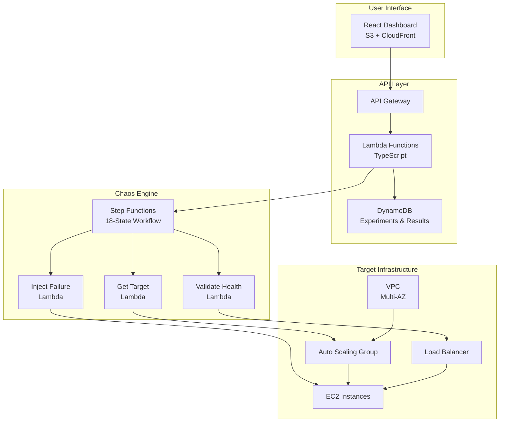

<div align="center">

# 🔥 Chaos Engineering Platform

### *Break things on purpose, before they break in production*

[](https://choosealicense.com/licenses/mit/)
[](https://aws.amazon.com/)
[](https://www.typescriptlang.org/)
[](https://reactjs.org/)
[](https://aws.amazon.com/cloudformation/)
[](https://github.com/ARAVIND281/Chaos-Engineering-Platform/pulls)

**Production-ready, full-stack Chaos Engineering platform built entirely on AWS**

Test your system's resilience by injecting controlled failures into your infrastructure.

[🚀 Quick Start](#-quick-start) • [📖 Documentation](#-documentation) • [🏗️ Architecture](#-architecture) • [💡 Examples](#-examples) • [🤝 Contributing](#-contributing)

---


*Modern React dashboard for managing and monitoring chaos experiments*

</div>

---

## 🌟 Why Chaos Engineering?

In today's complex distributed systems, **failure is inevitable**. The question isn't *if* your system will fail, but *when*. Chaos Engineering helps you:

- 🛡️ **Build Resilience** - Discover weaknesses before customers do
- 🎯 **Validate Assumptions** - Test if your failover actually works
- 📊 **Improve Monitoring** - Find blind spots in observability
- 🚀 **Increase Confidence** - Deploy with certainty your system can handle failures
- 💰 **Reduce Downtime** - Prevent costly outages through proactive testing

<div align="center">

### 🎯 From Netflix to Your Infrastructure

Inspired by Netflix's battle-tested Chaos Monkey, this platform brings enterprise-grade chaos engineering to your AWS environment.

</div>

---

## ✨ Features

<table>
<tr>
<td width="50%">

### 🎨 **Modern Full-Stack Dashboard**
- Beautiful React UI with shadcn/ui components
- Real-time experiment monitoring
- Interactive analytics and metrics
- Mobile-responsive design

### ⚡ **Serverless Architecture**
- 100% AWS serverless (Lambda + Step Functions)
- Auto-scaling and highly available
- Pay-per-use pricing model
- Zero server maintenance

</td>
<td width="50%">

### 🔧 **Powerful Chaos Experiments**
- Instance Termination
- CPU Stress Testing
- Memory Exhaustion
- Network Latency Injection
- Disk I/O Saturation

### 🔒 **Safe & Controlled**
- Dry-run mode for testing
- Automated rollback on failures
- Pre/post health validation
- Comprehensive audit logs

</td>
</tr>
</table>

### 🏗️ **Infrastructure as Code**

- **5 CloudFormation Templates** - Complete infrastructure automation
- **Multi-AZ VPC** - High-availability networking
- **Auto Scaling Groups** - Dynamic capacity management
- **Application Load Balancer** - Intelligent traffic distribution
- **DynamoDB** - Serverless database for experiments and results

### 📊 **Enterprise Features**

- **18-State Step Functions Workflow** - Sophisticated orchestration
- **CloudWatch Integration** - Detailed metrics and logging
- **Results Analytics** - Comprehensive experiment analysis
- **One-Command Deployment** - Deploy entire stack in 15 minutes

---

## 🚀 Quick Start

### Prerequisites

```bash
✅ AWS Account with admin access
✅ AWS CLI configured
✅ Node.js 18+ and npm
✅ Git
```

### Deploy in 3 Steps

```bash
# 1. Clone the repository
git clone https://github.com/ARAVIND281/Chaos-Engineering-Platform.git
cd Chaos-Engineering-Platform

# 2. Deploy everything (takes ~15 minutes)
./scripts/deploy-fullstack-complete.sh dev

# 3. Access your dashboard
# URL will be displayed after deployment completes
```

That's it! 🎉 Your chaos engineering platform is live.

<details>
<summary><b>📹 Watch Quick Start Video</b></summary>

Coming soon: Step-by-step video walkthrough

</details>

---

## 🏗️ Architecture

<div align="center">



</div>

### Component Architecture

| Component | Technology | Purpose |
|-----------|-----------|---------|
| 🎨 **Frontend** | React 18 + TypeScript + Vite | Modern dashboard for experiment management |
| 🔧 **Backend API** | Lambda + API Gateway | RESTful API for CRUD operations |
| 🗄️ **Database** | DynamoDB | Serverless data persistence |
| ⚙️ **Orchestration** | Step Functions | 18-state chaos workflow |
| 🔨 **Chaos Functions** | Python Lambda | Failure injection logic |
| 🌐 **Networking** | VPC + ALB | Multi-AZ infrastructure |
| 🎯 **Target App** | Auto Scaling Group | Sample application for testing |
| 📊 **Monitoring** | CloudWatch | Metrics and logging |

---

## 💡 Examples

### Creating Your First Experiment

<details open>
<summary><b>1️⃣ Through the Dashboard (Recommended)</b></summary>

1. **Access your dashboard** at the provided URL
2. **Login** with `admin@chaos-platform.com` / `any-password`
3. **Click "New Experiment"**
4. **Configure experiment:**
   ```
   Target: Auto Scaling Group
   Failure Type: Instance Termination
   Dry Run: ✅ Enabled (for first test)
   ```
5. **Click "Start Experiment"**
6. **Monitor in real-time** as the platform:
   - ✅ Validates system health
   - 🔥 Injects controlled failure
   - 📊 Monitors system response
   - ✅ Validates recovery
   - 📈 Generates detailed report

</details>

<details>
<summary><b>2️⃣ Through AWS CLI</b></summary>

```bash
aws stepfunctions start-execution \
  --state-machine-arn arn:aws:states:us-east-1:ACCOUNT:stateMachine:chaos-platform-chaos-experiment \
  --input '{
    "experimentId": "exp-cli-001",
    "targetType": "ASG",
    "targetId": "chaos-platform-asg",
    "failureType": "INSTANCE_TERMINATION",
    "dryRun": false,
    "configuration": {
      "expectedHealthyInstances": 2
    }
  }'
```

</details>

<details>
<summary><b>3️⃣ Programmatically (TypeScript)</b></summary>

```typescript
import { StepFunctions } from '@aws-sdk/client-sfn';

const stepfunctions = new StepFunctions({ region: 'us-east-1' });

await stepfunctions.startExecution({
  stateMachineArn: 'arn:aws:states:...:stateMachine:chaos-platform-chaos-experiment',
  input: JSON.stringify({
    experimentId: 'exp-programmatic-001',
    targetType: 'ASG',
    failureType: 'CPU_STRESS',
    dryRun: false
  })
});
```

</details>

### Sample Experiment Results

```
📊 Experiment: exp-2025-01-27-abc123
🎯 Target: chaos-platform-asg (2 instances)
🔥 Failure: Instance Termination
⏱️ Duration: 5m 32s

Results:
✅ Pre-check: System healthy (2/2 instances)
🔥 Chaos: Terminated i-0abc123
⏳ Recovery: Auto Scaling launched replacement
✅ Post-check: System recovered (2/2 instances)
📈 Availability: 99.8% maintained during test

Learnings:
• Auto Scaling Group successfully replaced failed instance
• Load Balancer detected unhealthy instance in 30s
• Application remained available throughout experiment
```

---

## 📖 Documentation

### 📚 Essential Reading

| Document | Description |
|----------|-------------|
| [🚀 Quick Deployment](docs/deployment/DEPLOY_NOW.md) | Get started in 5 minutes |
| [📖 Step-by-Step Guide](docs/deployment/STEP_BY_STEP_GUIDE.md) | Detailed walkthrough |
| [🔐 AWS IAM Setup](docs/deployment/AWS_IAM_SETUP.md) | Required permissions |
| [🏗️ Architecture Design](docs/fullstack/FULL_STACK_DESIGN.md) | System architecture |
| [📊 Project Summary](docs/fullstack/FULL_STACK_SUMMARY.md) | Component overview |

### 🎓 Learning Resources

- [Weekly Tutorials](docs/archive/weekly-guides/) - Step-by-step implementation guides
- [API Documentation](docs/api/) - Complete API reference *(coming soon)*
- [Troubleshooting Guide](docs/troubleshooting.md) - Common issues *(coming soon)*

---

## 💻 Project Structure

```
Chaos-Engineering-Platform/
├── 📁 infrastructure/          # CloudFormation templates
│   ├── vpc-infrastructure.yaml
│   ├── target-application.yaml
│   ├── chaos-lambda-functions.yaml
│   ├── chaos-step-functions.yaml
│   └── fullstack-database.yaml
│
├── 📁 lambda-functions/        # Chaos injection logic
│   ├── get-target-instance/    # Instance selection
│   ├── inject-failure/         # Failure injection
│   └── validate-system-health/ # Health validation
│
├── 📁 backend/                 # TypeScript API
│   ├── src/handlers/           # API endpoints
│   ├── src/services/           # Business logic
│   └── src/types/              # TypeScript types
│
├── 📁 frontend/                # React Dashboard
│   ├── src/components/         # UI components
│   ├── src/pages/              # Application pages
│   └── src/lib/                # Utilities
│
├── 📁 scripts/                 # Automation scripts
│   ├── deploy-fullstack-complete.sh
│   └── cleanup.sh
│
└── 📁 docs/                    # Documentation
    ├── deployment/
    ├── fullstack/
    └── archive/
```

---

## 💰 Cost Breakdown

<table>
<tr><td>

### Monthly Costs (24/7 Operation)

| Service | Configuration | Cost/Month |
|---------|--------------|------------|
| **EC2** | 2x t3.micro | ~$12 |
| **ALB** | Application LB | ~$16 |
| **NAT Gateway** | 2x (Multi-AZ) | ~$64 |
| **Lambda** | Low traffic | ~$5 |
| **DynamoDB** | On-demand | ~$5 |
| **S3** | Static hosting | ~$3 |
| **CloudWatch** | Logs + Metrics | ~$5 |
| **Total** | | **~$110/month** |

</td><td>

### Cost Optimization Tips 💡

- **Stop when not in use**: Run cleanup script → $0/month
- **Use Spot Instances**: Replace EC2 → Save 70%
- **Single NAT Gateway**: Dev/Test only → Save $32/month
- **Lambda-only testing**: Skip EC2 target → Save $28/month

### Free Tier Eligible ✨

First 12 months with AWS Free Tier:
- Lambda (1M requests/month)
- DynamoDB (25GB storage)
- S3 (5GB storage)

</td></tr>
</table>

---

## 🛠️ Tech Stack

<div align="center">

### Frontend


### Backend


### Infrastructure


</div>

---

## 🧪 Testing & CI/CD

<details>
<summary><b>Running Tests</b></summary>

```bash
# Backend tests
cd backend
npm test

# Frontend tests
cd frontend
npm test

# End-to-end tests
./scripts/test-end-to-end.sh
```

</details>

<details>
<summary><b>GitHub Actions (Coming Soon)</b></summary>

- ✅ Automated testing on PR
- ✅ Infrastructure validation
- ✅ Security scanning
- ✅ Deployment automation

</details>

---

## 🤝 Contributing

We love contributions! 💖

<table>
<tr>
<td>

### 🐛 Found a Bug?
[Report it →](https://github.com/ARAVIND281/Chaos-Engineering-Platform/issues/new?template=bug_report.md)

### 💡 Have an Idea?
[Suggest a feature →](https://github.com/ARAVIND281/Chaos-Engineering-Platform/issues/new?template=feature_request.md)

</td>
<td>

### 🔧 Want to Contribute?
[See CONTRIBUTING.md →](CONTRIBUTING.md)

### 💬 Questions?
[Join Discussions →](https://github.com/ARAVIND281/Chaos-Engineering-Platform/discussions)

</td>
</tr>
</table>

### Quick Contribution Guide

1. **Fork** the repository
2. **Create** your feature branch (`git checkout -b feature/AmazingFeature`)
3. **Commit** your changes (`git commit -m 'Add some AmazingFeature'`)
4. **Push** to the branch (`git push origin feature/AmazingFeature`)
5. **Open** a Pull Request

See our [Contribution Guidelines](CONTRIBUTING.md) for more details.

---

## 🗺️ Roadmap

### ✅ Completed (v1.0)
- [x] Full-stack React dashboard
- [x] Step Functions orchestration
- [x] Multi-AZ VPC infrastructure
- [x] Auto Scaling target application
- [x] Chaos Lambda functions
- [x] DynamoDB persistence
- [x] One-command deployment

### 🚧 In Progress (v1.1)
- [ ] Advanced analytics dashboard
- [ ] Experiment scheduling
- [ ] Slack/Teams notifications
- [ ] API authentication (JWT)

### 🔮 Future (v2.0+)
- [ ] Kubernetes chaos experiments
- [ ] Multi-region testing
- [ ] Custom failure plugins
- [ ] Team collaboration features
- [ ] Experiment templates library
- [ ] Cost optimization recommendations

---

## 📜 License

This project is licensed under the **MIT License** - see the [LICENSE](LICENSE) file for details.

```
MIT License - you can use, modify, and distribute this code freely.
```

---

## 🙏 Acknowledgments

<table>
<tr>
<td align="center">
<b>Inspired By</b><br/>
<a href="https://netflix.github.io/chaosmonkey/">Netflix Chaos Monkey</a>
</td>
<td align="center">
<b>Built With</b><br/>
<a href="https://ui.shadcn.com/">shadcn/ui</a>
</td>
<td align="center">
<b>Powered By</b><br/>
<a href="https://aws.amazon.com/">AWS</a>
</td>
<td align="center">
<b>Icons By</b><br/>
<a href="https://lucide.dev/">Lucide</a>
</td>
</tr>
</table>

---

## 📊 Project Stats


---

## 🌟 Star History

[](https://star-history.com/#ARAVIND281/Chaos-Engineering-Platform&Date)

---

## 🔗 Links

- **Repository**: [github.com/ARAVIND281/Chaos-Engineering-Platform](https://github.com/ARAVIND281/Chaos-Engineering-Platform)
- **Issues**: [Report a bug or request a feature](https://github.com/ARAVIND281/Chaos-Engineering-Platform/issues)
- **Documentation**: [Full documentation](docs/)

---

<div align="center">

### 💪 Built with determination | 🧠 Designed with intelligence | ❤️ Made with love

**If this project helped you, please give it a ⭐!**

[⬆ Back to Top](#chaos-engineering-platform)

---

**Made by [ARAVIND281](https://github.com/ARAVIND281) | Licensed under MIT | Contributions welcome!**

</div>
